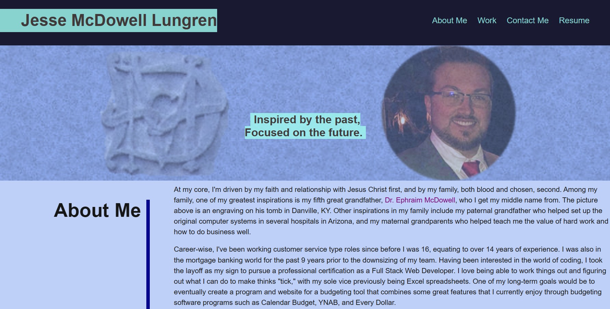
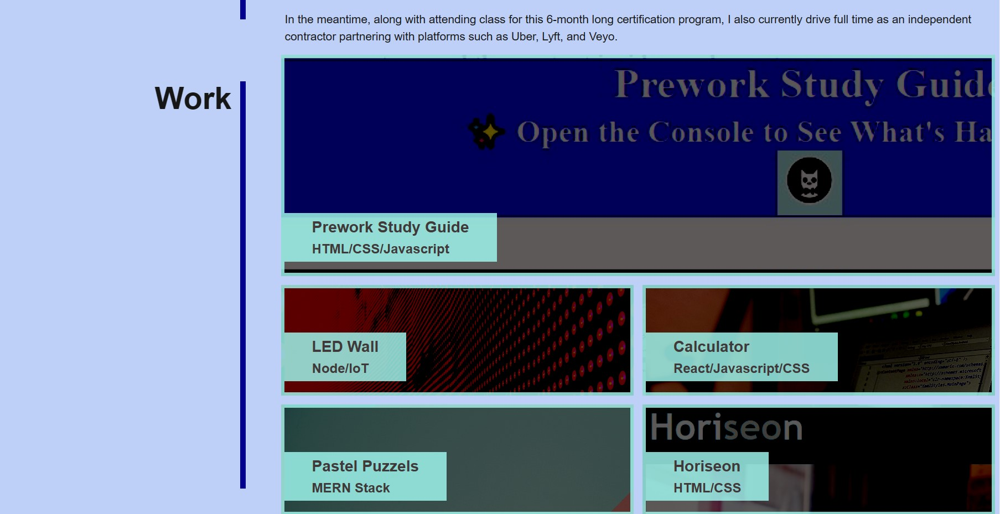

# My Portfolio

## Description

This is a webpage designed to host some of my web development work to assist with potential clients or employers hiring me. I hope to create a space that will allow people to get a peak at my work and my overall skills, while also providing a few easy options to get in contact with my directly.

## Table of Contents

- [Installation](#installation)
- [Usage](#usage)
- [License](#license)
- [Questions and Contributing](#questions-and-contributing)
- [Tests](#tests)

## Installation

N/A

## Usage

The top part of the webpage includes quick navigation items to get to my "About Me," "Work," "Contact," and "Resume" (which is linked to my LinkedIn). The body includes details about myself, some examples of work, and finally my direct contact information including my phone number, email, GitHub, and LinkedIn.

Screenshots as follows:

[My Portfolio Webpage](https://jmcdlungren.github.io/My-Portfolio/)

[GitHub Repository Link](https://github.com/jmcdlungren/My-Portfolio)

## License

[The MIT License](https://opensource.org/licenses/MIT)

## Questions and Contributing

If you have any questions, you can contact me by [email](j.mcd.lungren@gmail.com) or through [GitHub](https://github.com/jmcdlungren).

If you are interested in contributing, please follow the guidelines outlined within the [Contributor Covenant](https://www.contributor-covenant.org/).

## Tests

N/A